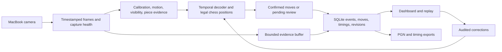

# Chess camera recorder: phased development plan

Planning baseline: 2 October 2026. This document describes future work; the repository currently contains only the Rust binary scaffold. Cargo is not installed in the current environment.

## Goal and first release

Build a macOS application that uses the **built-in MacBook camera**, aimed at a nearby physical chessboard, to record complete games and the elapsed time between moves. Prioritize correct move recording over immediate acceptance. Store games locally and provide a dashboard for replay, corrections, timing inspection, and PGN export for Chess.com.

The first release supports standard chess, a verified standard starting position, a stationary board/camera, and a documented range of board sizes, piece sets, lighting, camera angles, and playing speeds. Manual corner selection, orientation confirmation, and occasional ambiguity review are acceptable. Broader support must earn its own accuracy gate.

The central product rule is: **commit a move only when visual evidence supports it; preserve uncertainty when it does not**. A legal move can still be the wrong move. A chess engine's preferred move must never substitute for evidence.

A nearby laptop is not automatically a workable camera mount. At shallow angles, nearer pieces can hide farther pieces. Perspective correction changes geometry but cannot recover hidden information. Phase 0 must establish a useful built-in-camera placement before substantial implementation proceeds.

## Proposed architecture

Use Rust for capture, image processing, inference, chess logic, timing, persistence, and exports. Use a Tauri desktop shell with a small TypeScript dashboard. This is a Rust application with a web-based presentation layer; if every component must be Rust, choose an egui shell in Phase 1 while preserving the same core interfaces.



| Component | Initial choice | Decision or validation required |
| --- | --- | --- |
| Camera | `nokhwa` with its AVFoundation backend | Verify initialization, permissions, actual formats, timestamps, frame rate, and disconnect behavior on the target MacBook. Use a narrow native AVFoundation adapter if the wrapper cannot meet the capture contract. [Backend documentation](https://docs.rs/nokhwa/latest/nokhwa/backends/capture/struct.AVFoundationCaptureDevice.html) |
| Classical vision | Rust OpenCV bindings | Manual board-plane calibration, transforms, motion and change detection. Prove native dependency packaging early. [Official bindings](https://github.com/twistedfall/opencv-rust) |
| Model inference | `ort` / ONNX Runtime, CPU baseline | Export and validate actual model graphs before adopting them. Benchmark CoreML separately after CPU correctness; provider support does not guarantee acceleration for every graph. [Rust runtime](https://github.com/pykeio/ort), [CoreML provider](https://onnxruntime.ai/docs/execution-providers/CoreML-ExecutionProvider.html) |
| Chess rules | A crate behind a project-owned `RulesEngine` interface | Prefer `cozy-chess` as an MIT baseline; verify SAN helpers or implement a thoroughly tested notation adapter. `shakmaty` already provides legal moves and FEN/SAN/UCI, but is GPL-3.0-or-later. Record the project licensing choice before selecting it. [cozy-chess](https://github.com/analog-hors/cozy-chess), [shakmaty](https://github.com/niklasf/shakmaty) |
| Persistence | SQLite through `rusqlite` | One writer, versioned migrations, transactional move commits, consistent backup/restore. [Rust API](https://docs.rs/rusqlite/latest/rusqlite/), [SQLite transactions](https://www.sqlite.org/lang_transaction.html) |
| Desktop UI | Tauri | Native capture stays in Rust. Validate a packaged camera-enabled application early, including the usage description and required entitlements for the chosen distribution mode. [macOS bundle documentation](https://v2.tauri.app/distribute/macos-application-bundle/) |
| Interchange | Standard PGN using SAN | Chess.com supports loading PGN into its analysis board. Timing annotation preservation needs a separate test. [Chess.com documentation](https://support.chess.com/en/articles/8583825-how-do-i-use-the-analysis-board) |

These are proposed dependencies, not installed or pinned versions. Phase 1 selects versions against the target Rust toolchain and macOS release, then records lockfiles and reproducible build instructions. Python may be used for offline training/export; the shipped recording pipeline runs in Rust.

## Vision strategy and free model candidates

Begin with a known chess state and track changes. Use square occupancy, piece color/type probabilities, motion, and visibility across time to rank legal successor positions. Full-board classification is useful for setup verification and recovery, but should not replace trusted game history every frame.

| Candidate | Planned use | Constraint |
| --- | --- | --- |
| Classical change detection plus legal transitions | First baseline for the calibrated, known piece set | Cheap and explainable; may struggle with shadows, off-center pieces and occlusion. Measure before adding complexity. |
| ChessCog occupancy and piece models | First pretrained physical-board baseline; optional local fine-tuning | The project publishes model downloads and adaptation instructions. Code is MIT; checkpoint and dataset redistribution terms must be verified separately. Its training distribution is not evidence of success on this MacBook setup. [Official project](https://github.com/georg-wolflein/chesscog) |
| Small locally adapted occupancy/color/piece model | Improve failures using recordings of supported setups | Use data with documented rights. Preserve independent validation/test sessions and export equivalent preprocessing to ONNX. |
| ChessQueries | Optional research comparator | Public code and weights use PolyForm Noncommercial terms. It is a large model, so license suitability and MacBook resource use must pass before product adoption. Do not make it an unconditional dependency. [Official project](https://github.com/JSeytre/chessqueries), [model repository](https://huggingface.co/joelseytre/chessqueries) |

ChessReD can help benchmark physical-board recognition, but its dataset terms must be verified before use. Public still-image benchmarks cannot establish continuous move-recording or timing accuracy. [Original research](https://arxiv.org/abs/2310.04086)

For each adopted model, store a manifest containing source URL, code/weights/data terms, file hash, architecture, input/output schema, preprocessing, export procedure, inference provider, and evaluation results. Free download alone is insufficient to establish permitted redistribution. No paid inference service is required by this plan.

## Multi-agent execution flow

Use **one coordinator and up to three worker agents per wave**, matching the available four-agent capacity. Roles change by phase; this is a development workflow, not a multi-agent architecture inside the product.

The coordinator owns integration, shared contracts, dependency changes, migrations, phase gates, and the release decision. Worker agents receive explicit objectives, owned directories, dependencies, fixtures, and acceptance criteria. Prefer separate branches/worktrees during implementation; in a shared checkout, allocate non-overlapping files. Only the coordinator edits shared manifests and contract files once they are agreed.

Every wave follows this sequence:

1. Coordinator defines one reviewable deliverable and freezes the relevant contracts/fixtures.
2. Up to three agents implement independent tasks in parallel, using fixtures or mocks where upstream work is incomplete.
3. Each agent reports changes, validation, measurements, assumptions, and remaining failures.
4. Coordinator integrates changes in dependency order and runs the phase checks.
5. A reviewer who did not author the relevant change verifies the gate. Rotate an agent into this role after implementation rather than exceeding the concurrency limit.
6. Failed gates produce scoped follow-up tasks. A phase does not pass because its implementation tasks are finished.

Suggested ownership boundaries after Phase 1:

```text
crates/contracts/       # Coordinator: shared types and serialization
crates/chess-core/      # Rules, move decoding, timing and revisions
crates/capture/         # Camera adapters, timestamps and health events
crates/vision/          # Calibration, observations and model adapters
crates/storage/         # SQLite, evidence manifests and projections
crates/export/          # PGN and detailed timing exports
apps/desktop/           # Tauri shell and dashboard
tools/evaluate/         # Offline replay, annotations and reports
fixtures/               # Small reproducible cases; large recordings outside Git
docs/                   # Contracts, decisions, setup and evaluation results
```

The coordinator owns `Cargo.toml`, `Cargo.lock`, database migration numbering, and cross-component API changes. Model files and full recordings belong in versioned artifact storage or local fixture storage with hashes, not ordinary Git history.

## Phases and gates

### Phase 0 — Prove built-in-camera feasibility

**Deliverable:** a working capture probe, annotated sample recordings, a camera placement guide, and a go/no-go report.

| Agent | Parallel responsibility |
| --- | --- |
| Platform agent | Establish the Rust toolchain and a minimal packaged macOS capture probe; enumerate formats and timestamp behavior; test permission denial and recovery. |
| Vision agent | Test nearby placement, laptop elevation, distance and lid angle; map all squares; measure far-rank occlusion, blur and lighting sensitivity. |
| Evaluation agent | Define ground-truth move/timing annotation, record representative play, and catalogue setup failures and difficult events. |

Start with the actual board/pieces and a full starting formation. Test both board orientations and both players' hands. Capture quiet moves, captures, fast replies, and special-move clips. Use manual four-corner calibration first. An empty checkerboard demonstration is insufficient.

**Gate:** demonstrate a practical built-in-camera placement where all 64 square locations and the necessary piece changes are distinguishable between moves. Record the exact MacBook model/architecture and macOS version, achieved resolution/frame rate, supported geometry, far-rank square/piece-base pixel sizes, and calibration reprojection error. Set a minimum supported inter-move interval from evidence. If no practical placement works, document the limit and revisit scope with the user; do not silently substitute an external camera or promise that a bigger model fixes occlusion.

### Phase 1 — Establish contracts, chess state and durable storage

**Deliverable:** a reproducible Rust workspace, shared contracts, synthetic end-to-end recording, and a database that can replay the trusted game.

| Agent | Parallel responsibility |
| --- | --- |
| Chess agent | Implement rules adapter, legal transitions, UCI/SAN/FEN, and standard-position initialization. |
| Storage agent | Implement schema, migrations, event journal, move projection and correction revisions against frozen contracts. |
| Evaluation agent | Build synthetic observation sequences and independent reference cases, including special moves, repeated positions and malformed histories. |

The coordinator selects shell/dependency versions, app licensing, and timestamp/event schemas before workers implement adapters. Initialize side to move, castling rights and en passant state explicitly. Images alone do not establish historical rights; custom FEN starts are later work.

**Gate:** deterministic replay of recorded events produces the same trusted FEN chain. Each accepted ply and its supporting metadata commits transactionally and idempotently. Rules and notation cover captures, check, mate, disambiguation, both castling directions, en passant and all promotion choices. Duplicate events cannot create duplicate moves.

### Phase 2 — Build calibrated offline observations

**Deliverable:** replay recorded camera frames into probabilistic board observations with reproducible benchmark reports.

| Agent | Parallel responsibility |
| --- | --- |
| Geometry agent | Implement four-corner calibration, orientation, board-plane mapping, drift checks and setup quality feedback. |
| Model agent | Compare the classical baseline and ChessCog; audit artifacts; export the selected candidate and verify Rust preprocessing/inference parity. |
| Evaluation agent | Create session-separated train/validation/test manifests; measure square mapping, visibility failures, exact-board recognition and runtime cost. |

Map pieces using their board-plane location/base evidence where possible. Bounding-box centers and square crops can be misleading when upright pieces overlap adjacent squares at a shallow angle. Mark occluded/blurred squares as unknown rather than empty.

**Gate:** reproducible observations on real MacBook recordings; verified artifact terms and CPU inference; usable motion/visibility signals; documented failure classes. Select a provisional model from observation quality and runtime measurements. Final selection depends on its impact on move decoding in Phase 3. Keep held-out qualification sessions untouched.

### Phase 3 — Decode precise moves and preserve timing uncertainty

**Deliverable:** an offline recorder producing trusted moves, elapsed intervals, review items and evidence references.

| Agent | Parallel responsibility |
| --- | --- |
| Decoder agent | Implement temporal state machine, unchanged/legal-successor scoring and acceptance/abstention rules. |
| Timing/recovery agent | Implement observation bounds, interval calculations, bounded gap-reconstruction candidates and replay after corrections. |
| Evaluation agent | Challenge decoding with compound moves, hidden events, physical adjustments, takebacks and capture gaps. |

Use `Calibrating → Stable → Disturbed → Settling → Candidate → Confirmed`, with explicit `Uncertain` and `RecalibrationRequired` exits. Stability is measured in elapsed capture time, not a fixed number of frames. Include the unchanged position as a hypothesis so touching or centering a piece creates no move.

Compare expected legal positions against evidence across the whole board and multiple frames. Require enough visibility, absolute evidence quality and a margin over alternatives. Castling, en passant and promotion are single completed chess transitions even though players perform several physical actions. Wait for complete evidence; request review when the promoted piece is unresolved.

**Gate:** no automatic move for a piece adjustment, incomplete compound move or unsupported ambiguity. Legal-but-wrong hypotheses are rejected on evidence. Uncertain history never overwrites the trusted prefix. Test timing against annotated capture events and processing backlogs. Select the combined vision/decoder pipeline and freeze acceptance thresholds on validation sessions. Later changes require a new version and renewed validation before qualification. Proceed only with a measured improvement over the baseline and no unresolved systemic silent-error pattern.

### Phase 4 — Integrate live recording and recovery

**Deliverable:** a live recorder that saves a game while reporting its recording health.

| Agent | Parallel responsibility |
| --- | --- |
| Capture agent | Implement production timestamped capture, bounded queues, preview, dropped-frame accounting and camera health events. |
| Recorder agent | Connect observations, decoder, storage and evidence lifecycle; keep inference independent of capture and dashboard responsiveness. |
| Reliability agent | Exercise disconnects, board/camera movement, sleep/wake, backlog, process termination and restart. |

Capture may outpace inference. Use bounded queues and explicitly record discarded-frame gaps; never allow an unbounded backlog to make the application appear current. A gap can hide multiple moves and must enter recovery rather than assume one legal successor. Continue retaining evidence while trusted move acceptance is suspended.

Keep a bounded evidence buffer and persist clips/frames around moves and unresolved segments. Retention limits must be visible; if an unresolved segment exceeds available storage, mark the resulting evidence loss. Store model/calibration versions with observations. On restart, restore the last trusted prefix and revalidate the live board before accepting new moves.

**Gate:** a live sample game survives restart with every acknowledged move preserved; stale capture, drift and gaps become visible states. Hardware timestamps or the fallback host timestamp policy are measured and documented. A 60-minute session has bounded memory and acceptable latency on the target MacBook.

### Phase 5 — Deliver the dashboard and correction workflow

**Deliverable:** a usable application for recording and revisiting games.

| Agent | Parallel responsibility |
| --- | --- |
| Dashboard agent | Build game list/search/filter, game details, move-by-move board replay, timing chart and evidence viewer. |
| Review agent | Build pending-move resolution, manual move entry, promotion selection and audited correction/revalidation flow. |
| Export agent | Implement standard PGN, optional timing comments and JSON/CSV timing sidecars; validate round trips and Chess.com loading. |

The recording screen includes camera preview with board overlay, setup checks, trusted digital board, last accepted move, pending review, pause/resume/finish, and capture health. The game library includes date, players, result, ply count, duration and recording completeness. Replay shows SAN, board state, elapsed time, uncertainty and linked evidence.

A correction creates a revision, recomputes SAN/FEN for the affected suffix and validates every later move. Stop at the first invalid continuation and preserve it for review. Do not export a disconnected or silently repaired history. Finishing recording does not imply a known chess result; unresolved results use `*`.

**Gate:** a user can record, close, reopen, replay, resolve an uncertain move, correct an earlier move, and export the resulting game. Standard PGN imports into Chess.com analysis with matching moves and result; verify ordinary games and special moves. Timing survives in the database and sidecar even if an importer discards comments.

### Phase 6 — Qualify accuracy on held-out complete games

**Deliverable:** a frozen-candidate evaluation report, supported-setup statement and release decision.

| Agent | Parallel responsibility |
| --- | --- |
| Independent QA agent | Run the locked test manifest and full-game move/timing comparison; include denominator counts and uncertainty. |
| Reliability agent | Validate database recovery, correction consistency, export, backup/restore and packaged capture behavior. |
| Vision/decoder agent | Triage failures and propose scoped fixes without tuning against the locked final test set. |

Include multiple complete sessions and supported board/piece sets, both orientations, lighting changes, far-rank moves, captures, castling, en passant, every promotion, repeated positions, piece adjustments, takebacks, two hands, long occlusion, fast replies, board bumps and interrupted capture. Keep targeted edge-case clips separate from the complete-game qualification set.

Score automatic precision and coverage from the original automatic decisions before review, including decisions later corrected. Match them against the reference sequence; wrong, duplicate and extra automatic plies count as errors. Active correction revisions must not improve the reported automatic metrics.

Provisional release targets within the declared setup:

| Metric | Target and reporting rule |
| --- | --- |
| Automatic move precision | At least 99.9% correct among automatically committed plies; report errors and total automatic plies. |
| Automatic coverage | At least 95% of reference plies correctly recorded automatically; abstentions and gaps stay in the denominator. |
| Unattended whole-game correctness | Report exact games with no corrections or missing plies separately; aim for at least 90% for the first supported setup. Move-level accuracy cannot establish this metric. |
| Correctness after review | Every game labelled verified must exactly match the audited reference. Incomplete/unresolved games remain clearly labelled. |
| Timing | For visibly observable completion events, aim for 95th-percentile error within 0.5 seconds. Also report interval width, uncertain/unknown fraction and interval coverage against annotations. Hidden events are not counted as precisely timed. |
| Commit latency | Aim for 95th percentile within 1 second after sufficient clear settled evidence becomes available. Report separately from timing error. |
| Persistence/export | No duplicate plies, illegal accepted histories, lost acknowledged commits in tested crashes, or PGN/reference mismatches. |

Qualify on at least 3,000 reference plies, at least 3,000 automatically committed plies, and 30 complete games, plus the edge-case suite. Extend the reference recordings as needed to reach the automatic-decision count. Report statistical uncertainty and setup distribution; this sample alone does not guarantee the target error rate. If tuning follows a failed final evaluation, use a fresh held-out qualification set for the next release decision. Coverage, review burden and timing uncertainty prevent inflated results from excessive abstention.

**Gate:** all required measurements are published and the supported-setup targets pass. Investigate any unflagged wrong move in the qualification run before release. Narrow the declared supported conditions or improve the pipeline when targets fail; do not relabel reviewed games as unattended successes.

### Phase 7 — Package and release the supported version

**Deliverable:** a reproducible macOS application bundle, local database lifecycle, setup instructions, and release notes with measured limits.

| Agent | Parallel responsibility |
| --- | --- |
| Platform agent | Bundle native libraries and model assets; verify runtime loading, camera permission and installation on a clean target Mac. |
| Data agent | Finalize migration/backup/restore, media retention and database-plus-evidence consistency. |
| QA/documentation agent | Repeat the critical packaged-app flows and publish placement guide, review guidance and accuracy report. |

CPU inference remains the correctness reference. Adopt CoreML only if parity and target-hardware performance pass. Declare Apple Silicon support first if that matches the actual MacBook; Intel or additional macOS versions require separate qualification. Signing/notarization and its account requirements depend on the chosen distribution channel; local development and published distribution are separate milestones.

**Gate:** the packaged application completes the same recording, review, restart, replay and export flows without development-only paths or services.

### Later phases — Expand only after precision is established

Custom initial FEN positions, automated board localization, broader piece-set support, faster play, optional external cameras, clock recognition and engine analysis can follow. Each changes the supported conditions and needs new fixtures and accuracy gates. Cloud sync/accounts are optional later product work; the first release uses local storage.

## Data and timing contracts

| Record | Required content |
| --- | --- |
| Game | ID, players, UTC date, result, initial FEN, recording/completeness status, active revision, optional event/site/time-control metadata. |
| Capture session | Game ID, session/clock epoch, UTC anchor, camera identity/format, timestamp source, calibration/model versions, pause/outage spans. |
| Observation | Frame sequence, capture timestamp, square likelihoods, visibility/motion/quality flags and observation version. Keep high-volume transient data bounded; persist the observations needed for evidence and recovery. |
| Move | Game/revision/ply, side, canonical move/UCI, derived SAN, FEN before/after, evidence references, confidence, provenance (`automatic`, `reviewed`, `inferred`, `manual`). |
| Timing | Observation estimate when justified, lower/upper completion bounds, elapsed estimate/bounds, confirmation time, and quality (`observed`, `bounded`, `unknown`). |
| Event/review/revision | Original decision, alternatives, gap reason, reviewer correction, affected suffix and parent revision. Original evidence/history remains auditable. |
| Evidence | File reference, hash, capture interval, retention status and associated events/plies. Stage files and reconcile manifests so interrupted writes do not create false evidence claims. |

Store elapsed durations using integer units, such as microseconds, and UTC for display/session identity. Normalize device presentation timestamps into a session monotonic timeline when available. If only host acquisition timestamps are available, record that fallback and characterize capture delay. Do not compute durations from wall-clock differences or inference completion times.

Define a move boundary as the physical completion of the full chess transition, estimated from the first clear settled evidence of its resulting position. Preserve bounds from the last trusted pre-move evidence to the first trusted completed-position evidence. The estimate and interval describe what the camera observed; debounce/confirmation latency is a separate field.

For two move-completion intervals `[L_previous, U_previous]` and `[L_current, U_current]`, the elapsed interval is `[L_current - U_previous, U_current - L_previous]`, constrained by chronological ordering. A point estimate is optional. The first move has elapsed time only when a reliable game-start marker exists. Across gaps, restarts or unobserved play, individual move times can remain unknown.

If several moves occur while hidden, bounded legal sequence search may offer reconstruction candidates. Even a unique candidate is stored as inferred; it does not acquire invented timestamps. Multiple indistinguishable histories require review. Pause/resume marks an observation gap and never implies that players stopped playing.

This elapsed interval is the time between observed move completions. It is not a remaining clock reading or necessarily official thinking time.

## Chess.com export contract

Export clean PGN with the standard Event, Site, Date, Round, White, Black and Result tags, legal SAN movetext and the matching termination marker. Future nonstandard starts require `SetUp` and `FEN`. Validate exports against the active trusted revision and an independent parser. [PGN specification](https://www.saremba.de/chessgml/standards/pgn/pgn-complete.htm)

Offer an annotated export with ordinary comments, for example `1. e4 {elapsed 2.340s; timing estimated}`. A comment is descriptive metadata, not a guarantee that Chess.com preserves or displays it. Use detailed JSON/CSV sidecars for exact timings, bounds, confidence and evidence identifiers. Never encode elapsed duration as a `[%clk]` remaining-clock value.

The compatibility milestone is loading exported games into Chess.com analysis and verifying the moves. Direct account synchronization is future scope and is not assumed by this plan. Incomplete games can export only their valid trusted prefix with result `*` and a clear incompleteness note.

## First implementation wave

Start with Phase 0: establish the toolchain, package a minimal camera probe, document a practical built-in-camera placement, and produce annotated reference clips. Do not begin with dashboard polish or a large model download. The resulting evidence determines the supported setup, initial model choice and achievable timing precision.
